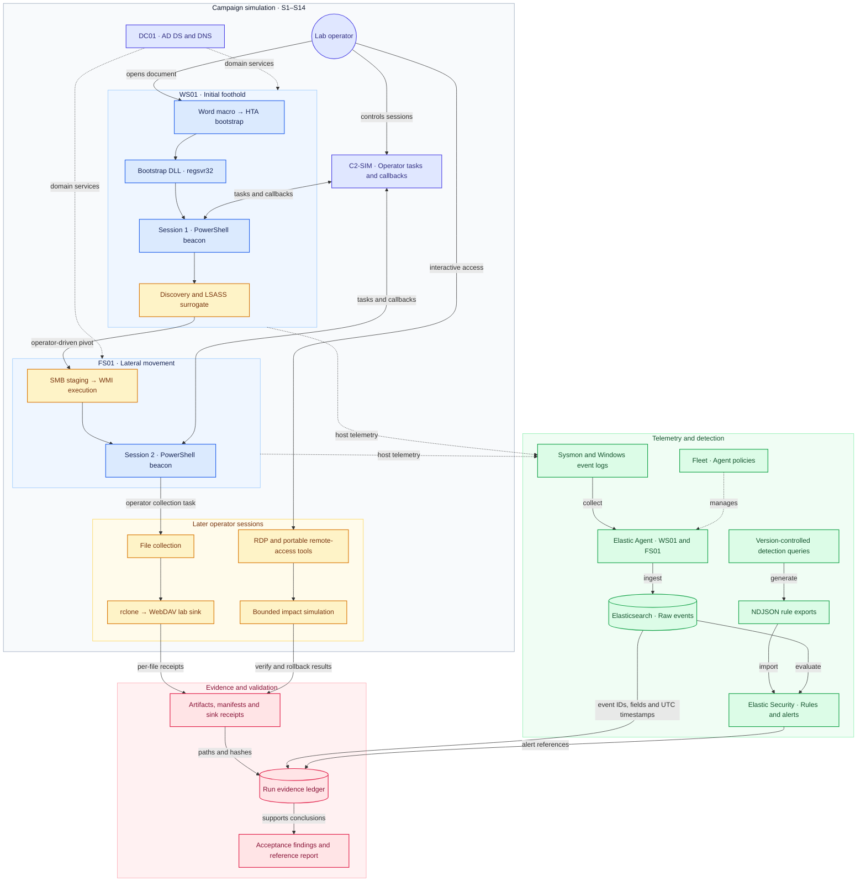

# C0015 Detection Lab

Evidence-driven reconstruction of [MITRE ATT&CK Campaign C0015](https://attack.mitre.org/campaigns/C0015/)
(Conti/Bazar intrusion, DFIR Report *CONTInuing the Bazar Ransomware Story*, 2021-11-29) as a detection
engineering and incident-response exercise on an owned homelab.

**Problem.** Intrusions starting with BazarLoader frequently end with Conti ransomware. The observable
signals — macro delivery, HTA/DLL proxy execution, live-off-the-land discovery, WMI pivots, SMB tool
handoffs, rclone exfiltration, RDP/AnyDesk remote access, and impact — are individually well known, but the
*chain* as a correlated whole is rarely exercised. This lab reproduces that chain end to end with real
Windows/AD/network telemetry, benign payload surrogates, an internal C2 simulator, artifact-verified stage
handoffs, and a detection suite validated against a recorded reference run.

## Read order

1. [reports/reference-run-20261002-05.md](reports/reference-run-20261002-05.md) — what was observed, which
   rules matched, what stayed partial.
2. [detections/README.md](detections/README.md) — the rule suite (R01-R20), stage mapping and coverage.
3. [evidence/runs/RUN-20261002-07/](evidence/runs/RUN-20261002-07/) — ledger with event references and
   hash-verified artifacts.
4. Verification: acceptance checks in `scripts/verify/verify_final_phases.py <RUN_ID>` (Elastic, env credentials); offline component tests via `python -m unittest discover -s scripts/tests` (20 tests);
   Elastic-gated checks are documented in `scripts/verify/`.

## Project architecture and workflow



| Node | Role | Environment |
|---|---|---|
| WS01 | beachhead victim (Windows 10) | macro entry, beacon, operator actions |
| FS01 | file server (Windows 10 Pro, build 19045) | shares Finance/IT, WMI pivot target, impact corpus |
| DC01 | domain controller | telemetry-only (no interactive use, mirroring the campaign) |
| Kali | auxiliary | optional tooling host |
| C2 host | operator (this repository) | C2-SIM, HTTP staging, internal sink, Elastic access |
| Elastic/Fleet | telemetry backend | managed stack; ingestion aliases `logs-windows.sysmon_operational-c0015*`, `logs-system.security-c0015*` |

## Validated results (reference run RUN-20261002-07)

- **Entry chain (S1)**: the entry document's macro **self-writes** config.ini/bootstrap.hta/c0015_beacon.ps1
  (no tooling on disk before the open) → mshta → HTA → regsvr32 → beacon (registered session with token).
- **Operator phase (S4-S9)**: discovery runbook, elevated beacon, LSASS surrogate (E10 0x1010 — no
  extraction), SMB handoff (Security 5145), WMI pivot with the **space-form** rundll32 call
  (E1 parent=WmiPrvSE, E7 hash-verified) and a server-side receipt (ART-07-01).
- **Final phases (S10-S15)**: collection (11 files, ART-08-01), **real rclone** in two rounds to the
  internal WebDAV sink (ART-09-01 receipts, 11/11 hash equality per round), RDP network-auth logons
  (no completed interactive logon — **S12 partial**), AnyDesk/ProcessHacker drops (E11/E1), and a bounded
  impact surrogate with **bidirectional verify + rollback** (ART-14-01) - exercised by RUN-20261002-06; the earlier run (RUN-20261002-05) used the one-directional verify then in force.
- **Detection**: 24 rules (R01-R24, R21 retired); alerting rules R17/R18/R23 correlated with their building blocks
  per the correlation map; alert counts recorded as raw stored values (upper bounds).

## Campaign chain — original tools and lab surrogates

| Stage | Technique (MITRE) | Original tool (report) | Lab surrogate | Telemetry anchor | Detection |
|---|---|---|---|---|---|
| S1 | T1204.002/T1059.005 → T1218.005/T1218.010/T1105 | Word macro → HTA → regsvr32 Bazar DLL | entry document `c0015_entry.docm` (macro self-writes config/HTA/beacon) + `c0015_143_surrogate.dll` | Sysmon E1 office→mshta→regsvr32, E11 macro writes | R01-R08 |
| S2-S3 | T1071.001, T1016 | Bazar C2 / Cobalt Strike | `c0015_beacon.ps1` (phase3) → C2-SIM :8080 | E1/E3 + `register` | R05/R06/R09 |
| S4-S5 | T1057/T1069/T1482/T1016/T1018/T1135 | AdFind, net, nltest, PowerView (Invoke-ShareFinder) | `scripts/runbooks/c0015-phase2.json` | E1 beacon→cmd→tool | R10-R13 |
| S7 | T1078 | valid accounts | `C0015\it.admin` | Security 4624/4672 | R14a/R14b |
| S7b | T1003.001 | ProcessHacker (dump) | mimikatz-style surrogate (signed off, no extraction) | Sysmon E10 0x1010 | R15 |
| S8a | T1570/T1105 | SMB **C$** + `143.dll` copy | beacon-side copy + `143.dll` → FS01 `C:\C0015` | Security 5145 + E11 | R16 |
| S8b | T1047/T1218.011 | `wmic ... rundll32 ... 143.dll` | space-form `rundll32.exe ... LabEntry` (WMI) | E1 wmiprvse→rundll32 | R17 |
| S9 | T1071.001 | Cobalt Strike session 2 | beacon (phase7-session2, FS01) | E3 :8080 + receipt ART-07-01 | R18 |
| S10 | T1005/T1039/T1074.001 | ShareFinder re-run, staging | beacon UNC collection → `C:\C0015\collect\` | E11 + S5145 | R16 |
| S11a/b | T1567.002/T1030 | **rclone → MEGA** (two rounds) | real rclone → **local WebDAV sink** (:9001) | E1 rclone, E3 :9001, receipt ART-09-01 | evidence + receipts |
| S12 | T1021.001 | RDP to the backup server (day 2) | RDP `mstsc` + `cmdkey` | Security 4624 T3 network / T10 RemoteInteractive (T10 observed; lifetime not captured) | R19 |
| S13 | T1219.002 | AnyDesk in `Videos\`, ProcessHacker at `C:\` | real AnyDesk (lab-internal) + ProcessHacker | E11 drop paths + E1 | R20 |
| S14 | T1486/T1083 | `locker.bat` + Conti (`-m -net -size 10 ...`) | `c0015_impact.ps1` bounded surrogate (reversible) | E11 note + name-change creates | R22/R23 |

## Repository structure

```
phases/       phase1-initial-access | phase2-operator | phase3-final-campaign   (each with its own README)
docs/         canonical technical records (chain, runbook, architecture, correlation, C2 design)
detections/   rule suite R01-R20: queries/*.eql (sources) + exports/*.ndjson (generated) + README
reports/      executive report per reference run
payloads/     lab tooling per chain stage (beacon, dll, hta, impact, docm, lsass, packaging)
scripts/      infrastructure: C2-SIM, watchdog, evidence toolkit, rule generator, verifiers
configs/      agent/Sysmon configuration
evidence/     runs/<run_id>/: ledger (schema-conform, event references) + hash-verified artifacts
stage/        runtime files (generated document, per-run configs, tools) — gitignored
```

## Detection engineering

24 rules across R01-R24 (R14a/R14b and R22/R23/R24 included) implement a layered model mirroring the intrusion chronology: initial
access (R01-R08), beacon live-off-the-land activity (R09-R13), credential access and lateral movement
(R14a-R18), and remote access (R19-R24 — RDP, portable tool, note class/spread, transfer; R19 positively tested on RUN-20261002-06/-07). The alerting set — **R17**
(WMI pivot to an unsigned module) and **R18** (proxy-spawned beacon egress) — is high severity; the
remaining rules operate as correlation building blocks with suppression on noisy sources (see the
building-block → alerting correlation map in `detections/README.md`). Every rule uses a deterministic
`rule_id` (SHA-256 of the rule name; renames migrate server-side) and is written without
environment-specific values. `scripts/rules/gen_rules_ndjson.ps1` rebuilds the exports and fails fast on
empty queries; Offline component tests cover the evidence tooling and C2-SIM logic (`python -m unittest discover -s scripts/tests`).

## Confinement

- Exfiltration terminates at an internal sink; no public cloud service is used.
- Impact is a bounded, allowlist-capped and reversible surrogate — no real encryption, no self-propagation.
- Remote-access software runs lab-internal only; vendor-relay traffic the application itself initiates is
  observed but never used as a C2 channel.
- Secrets are never stored in the repository; per-run credentials remain in gitignored runtime directories.

## Key documents

- [docs/attack-chain-plan.md](docs/attack-chain-plan.md) — the canonical S1-S15 chain and fidelity blocks.
- [docs/attack-runbook.md](docs/attack-runbook.md) — operator runbook with per-stage procedures.
- [docs/architecture.md](docs/architecture.md) — lab topology, channels, Elastic/Fleet ingestion.
- [docs/correlation-architecture.md](docs/correlation-architecture.md) — telemetry correlation design.
- [docs/telemetry-comparison-c0015-vs-lab.md](docs/telemetry-comparison-c0015-vs-lab.md) — event-level parity.
- [docs/payloads-and-c2.md](docs/payloads-and-c2.md) — payload and C2 design.
## Environment versions (reference run)

| Component | Version (as used in RUN-20261002-07) |
|---|---|
| VMware Workstation | host-side; VMs WS01/FS01/DC01 (Windows 10 / Windows 10 Pro 19045 / Server), Kali |
| Elastic / Fleet | managed stack (ingestion aliases above) |
| Python (tooling) | 3.12.x |
| PowerShell (tooling) | 7.x (pwsh) |
| Sysmon | 15.21 (schema 4.91), profile `configs/sysmon/sysmon-c0015-balanced.xml` |
| rclone | 1.75.1 (transferred with the documented flags) |
| ProcessHacker / AnyDesk | 2.39 / standalone build |


