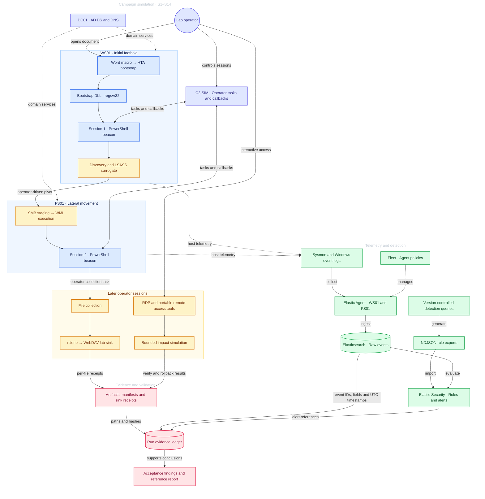

# C0015 Detection Engineering Lab

An evidence-driven reconstruction of [MITRE ATT&CK Campaign C0015](https://attack.mitre.org/campaigns/C0015/),
based on [The DFIR Report: CONTInuing the Bazar Ransomware Story](https://thedfirreport.com/2021/11/29/continuing-the-bazar-ransomware-story/)
(29 November 2021). The project studies how an intrusion becomes observable, how detection rules respond,
and how each conclusion can be traced to a recorded lab run.

The homelab combines Windows/Active Directory telemetry, benign payload surrogates, an internal C2
simulator, and Elastic Security. It follows the entry, discovery, lateral movement, collection, transfer,
remote-access, and impact portions of the campaign. Historical behavior, lab substitutions, and evidence
limitations are kept separate.

**Project scope:** campaign stages S1–S14, followed by validation and recovery. S6 target-manifest
orchestration was not executed in the recorded runs; S15 is post-run validation, not campaign behavior.

**Detection suite:** 24 rules — 23 EQL rules and one KQL threshold rule. R17, R18, and R23 are
high-severity alerting rules; the other 21 are building blocks.

## Start here

1. [Reference run RUN-20261002-07](reports/reference-run-20261002-07.md) — observed chain, detection
   results, activity counts, and recovery.
2. [Run-07 ledger](evidence/runs/RUN-20261002-07/RUN-20261002-07.json) and
   [artifacts](evidence/runs/RUN-20261002-07/) — event references, transfer receipts, and verification outputs.
3. [Detection queries](detections/queries/) and [import bundles](detections/exports/) — the implemented
   predicates and their exported configuration. The [detection catalogue](detections/README.md) provides
   investigation context.
4. [Operator runbook](docs/attack-runbook.md) — the documented lab procedure, evidence collection, and
   cleanup.

RUN-07 is the evidence reference used in this README. [RUN-08](reports/reference-run-20261002-08.md) is
the latest recorded replay; its ledger still contains approximate timestamp placeholders and fewer
event IDs, so it is listed separately rather than used to replace the more explicit RUN-07 citations.

## Project architecture and workflow



Fleet manages endpoint policies; Elastic Agents send telemetry to Elasticsearch, where Elastic Security
evaluates the rules. Event references and lab artifacts are recorded together in the run ledger.

| System | Role | Lab address / purpose |
|---|---|---|
| WS01 | Windows 10 initial workstation | `192.168.50.20`; document entry, session 1, operator tooling |
| FS01 | Windows 10 Pro file server / target | `192.168.50.30`; Finance/IT shares, WMI pivot, session 2, impact corpus |
| DC01 | AD DS and DNS for `c0015.lab` | `192.168.50.10`; domain infrastructure, no interactive operator use |
| Windows C2 host | Operator and internal services | `192.168.50.1`; HTTP staging `:8000`, C2-SIM `:8080`, WebDAV sink `:9001` |
| Kali | Auxiliary tooling and telemetry routing | `192.168.50.100`; Tailscale routing to the Elastic backend |
| ELASTIC01 | Elasticsearch, Kibana, Fleet Server | Tailscale `100.77.46.126`; endpoint policy `C0015-Windows-Endpoints` |

Domain traffic uses VMware VMnet2 (`192.168.50.0/24`, host-only, DHCP disabled). WS01 and FS01 also
have NAT adapters for installers and updates. Endpoint events use namespace `c0015`; the rule bundles
target `logs-windows.sysmon_operational-c0015*` and `logs-system.security-c0015*`.

## Recorded results

The following results come from RUN-07 and its committed evidence. They describe the lab replay,
not execution of the original Bazar/Conti malware.

| Area | Recorded outcome | Evidence |
|---|---|---|
| Entry and session 1 | The Word macro writes the bootstrap files; WINWORD → mshta → regsvr32 leads to beacon registration | S1–S3 ledger; entity joins and C2 registration |
| Discovery and identity | Discovery/share-enumeration tasks and administrative context; LSASS surrogate access mask `0x1010` | S4–S7b; Sysmon E1/E10 and Security events; no credential extraction claim |
| Lateral movement and session 2 | SMB staging followed by WMI-spawned rundll32, an unsigned module load, and the FS01 callback | S8a–S9; Security 5145, Sysmon E1/E7/E3, ART-07-01 |
| Collection and transfer | 11 files / 309 bytes; two rclone rounds with 11/11 name, size, and hash equality in each receipt | ART-08-01 manifest and two ART-09-01 receipts |
| RDP | Type-10 interactive logon on FS01 at `09:03:26.968Z`; R19 alerts recorded at `09:03:38Z` | S12 event `AaD72qiPmO7CP6S6j0bF` and archived alert references |
| Remote tools | AnyDesk drop followed by execution; ProcessHacker drop observed | S13 E11/E1 references |
| Bounded impact and recovery | 15-file surrogate run; 30 bidirectional verification mismatches after impact, then rollback and hash equality | ART-14-01 JSON summary and console output |
| Detection | R17: 3 stored docs / 1 sequence; R18: 6 docs / 2 activities; R23: 1 alert; R19: 2 docs / 1 Type-10 logon | Reference report and run ledger |

Stored alert documents are not incident counts. Look-back overlap, polling, and suppression affect volume;
activity counts are only reported where the run report establishes them.

### Recorded runs

| Run | Role in this repository | Report / ledger |
|---|---|---|
| RUN-20261002-05 | Initial recorded run; R19 rule coverage began after its Type-10 events; impact verification used the earlier one-directional implementation | [Report](reports/reference-run-20261002-05.md) · [Ledger](evidence/runs/RUN-20261002-05/RUN-20261002-05.json) |
| RUN-20261002-06 | Replay with R19 positive and bidirectional impact verification | [Report](reports/reference-run-20261002-06.md) · [Ledger](evidence/runs/RUN-20261002-06/RUN-20261002-06.json) |
| RUN-20261002-07 | Evidence reference for this README; tuned rules and R22/R23/R24 coverage | [Report](reports/reference-run-20261002-07.md) · [Ledger](evidence/runs/RUN-20261002-07/RUN-20261002-07.json) |
| RUN-20261002-08 | Latest recorded replay; report records acceptance and repeat coverage, with ledger provenance limitations noted below | [Report](reports/reference-run-20261002-08.md) · [Ledger](evidence/runs/RUN-20261002-08/RUN-20261002-08.json) |

All four committed scorecards record `ACCEPTED`. This means that the configured acceptance assertions
passed at verification time. It does not mean that every planned stage ran, every telemetry field was
populated, or every RDP session was fully characterized.

## Campaign behavior and detection coverage

| Stage | Behavior represented in the lab | Telemetry / evidence | Rules |
|---|---|---|---|
| S1 | Word macro entry and script/proxy handoff | E1 parent/entity chain; E11 bootstrap writes | R01–R08 |
| S2–S3 | HTA/DLL bootstrap and session-1 callback | E1/E3/E7; markers and C2 registration | R05/R06/R09/R18 |
| S4–S5 | Discovery and share enumeration | E1 command/process ancestry | R10–R13 |
| S6 | Target-manifest orchestration | NOT RUN; recorded explicitly in the ledgers | No coverage claim |
| S7 | Authentication and privileged logon context | Security 4624/4672; same-host logon IDs | R14a/R14b |
| S7b | LSASS-access surrogate | E10 process access; no extraction inferred | R15 |
| S8a | SMB admin-share handoff | Security 5145 and target-side E11 | R16 |
| S8b | WMI-spawned proxy loading an unsigned DLL | E1 → E7 on the same process entity | R17 |
| S9 | FS01 session-2 beacon callback | Entity-owned E3 and ART-07-01 receipt | R18/R09 |
| S10 | UNC collection and staging | E11, Security 5145, ART-08-01 manifest | R16 covers admin shares; Finance/IT reads require analyst review |
| S11a/b | rclone transfer to an internal WebDAV sink | E1 → E3 and per-file ART-09-01 receipts | R24 |
| S12 | RDP interactive logon | Security 4624 Type 10; R19 references | R19 |
| S13 | Portable remote-access/process tools | E11 drop and E1 execution | R20 |
| S14 | Reversible impact surrogate and note spread | E11; ART-14-01 verification and rollback | R22/R23 |

The initial bootstrap DLL is `c0015-comparefor.jpg`, built from
[payloads/dll/c0015_bootstrap_dll.c](payloads/dll/c0015_bootstrap_dll.c).
The separate `c0015_143_surrogate.dll` belongs to the FS01 lateral-movement stage.
The [historical mapping and fidelity notes](docs/attack-chain-plan.md) describe the source campaign and
which behaviors are inferred or replaced by lab surrogates.

## Detection engineering

The suite uses behavioral process ancestry, module signature/path context, logon fields, file creation,
and process-owned network connections. Detection predicates avoid hardcoded lab IPs, hostnames, and
accounts; index patterns and ingest mappings remain specific to this lab.

| Rule group | Purpose |
|---|---|
| R01–R08 | Office/script/proxy execution and staging |
| R09 | Proxy-spawned PowerShell network activity |
| R10–R13 | Discovery ancestry and share enumeration |
| R14a/R14b/R15 | Authentication, privileged context, and LSASS access |
| R16–R18 | Admin-share access, WMI pivot, and proxy-spawned egress |
| R19/R20 | RDP and portable remote-access/process tools |
| R22/R23 | Potential impact-note creation and same-process note spread |
| R24 | Transfer-tool process egress |

**Alerting rules:** R17 (WMI-spawned unsigned module), R18 (proxy-spawned PowerShell egress), and
R23 (note spread across distinct paths). **Building blocks:** the remaining 21 rules.

R17 and R18 are EQL sequences; R23 is a KQL threshold rule grouped by `host.name` and
`process.entity_id`, requiring at least three distinct `file.path` values.
The rules evaluate raw events. Cross-rule building-block relationships are analyst correlation guidance;
there is no claim that a campaign-level rule consumes those building-block alerts.

### Import bundles

- [c0015-rules-r01-r11.ndjson](detections/exports/c0015-rules-r01-r11.ndjson) — 11 rules.
- [c0015-rules-r12-r24.ndjson](detections/exports/c0015-rules-r12-r24.ndjson) — 13 rules, including
  R14a/R14b and R22–R24. R21 is retired.

The generator is [scripts/rules/gen_rules_ndjson.ps1](scripts/rules/gen_rules_ndjson.ps1).
It rejects empty queries and duplicate rule IDs. IDs are derived from rule names; a rename changes the ID
and requires migration rather than assuming the old server-side rule is overwritten.

The exported schedule is one minute, with a six-minute EQL look-back and a ten-minute R23 threshold
window. Suppression is configured for selected rules; its presence alone does not establish a measured
reduction in unique activity.

## Evidence and verification

Each [run directory](evidence/runs/) contains a ledger, an artifact index, manifests, receipts, and
verification outputs. The public repository records selected evidence and event references; it is not
a complete export of the Elasticsearch telemetry.

Artifact-file SHA-256 values use CRLF → LF normalization, as documented by the verifier. Transfer
receipts separately record observed payload-file names, sizes, and SHA-256 values for comparison with
the collection manifest. Artifact hash integrity and event-reference completeness are distinct checks.

### Offline component tests

From the repository root:

```bash
python -m unittest discover -s scripts/tests
```

The current suite contains 20 tests for artifact/manifest/receipt handling, fixtures, and C2-SIM logic.
These are component tests; they do not execute EQL in Elastic or prove a live campaign replay.

### Acceptance against retained telemetry

With the documented runtime log and authorized Elastic credentials available:

```bash
python scripts/verify/verify_final_phases.py RUN-20261002-07
```

The verifier requires `ES_PASS`; `ES_URL` and `ES_USER` select the backend and account.
It queries retained events/alerts and checks committed artifacts. Live acceptance depends on telemetry
retention and the runtime C2 log; the recorded scorecard preserves the result from the run.

## Known limitations

| Item | What is established | Remaining limitation |
|---|---|---|
| S6 | The target-manifest stage is explicitly NOT RUN in all four ledgers; the runbook calls it skipped by design | No claim of automatic target-selection orchestration |
| S12 | Type-10 interactive logons are observed; R19 is positive in RUN-06/07/08 | Session lifetime/disconnect evidence was not collected; stage characterization remains PARTIAL |
| E7 | ImageLoad enabled (BALANCED); E7 unsigned load joined to the pivot entity with ****`file.hash.sha256` present (ECS) on all four runs - equals the surrogate artifact hash (cbcd2a8b...) | **resolved** (verified 2026-10-02; hash read at `file.hash.sha256`, not `winlog.event_data.Hashes`) |
| RUN-08 provenance | The report and scorecard record a successful replay | Ledger timestamps include seven placeholders such as `09:33:1xZ`; many event refs lack an Elasticsearch ID, and some timings disagree with the report |
| Collection and tool correlation | Admin-share access and tool drop/run signals are observable | R16 does not cover ordinary Finance/IT share reads; R20 joins on host and does not prove binary identity |
| Historical fidelity | Real Windows telemetry and bounded surrogate mechanisms are exercised | Credential provenance, original malware internals, external cloud transfer, and encryption are not reproduced |

S12's earlier missing-Type-10 concern and E7's earlier disabled-event concern have been resolved in the
recorded runs. The limitations above refer to different remaining evidence requirements. Updating a
configuration or passing the acceptance assertions does not retroactively add missing fields or records
to an earlier run.

Run-specific reports and ledgers distinguish observed results from design intent. Some supporting design
documents retain historical state descriptions; use an explicitly identified run when comparing claims.

## Repository map

| Directory | Contents |
|---|---|
| [phases/](phases/) | Phase narratives and investigation context |
| [docs/](docs/) | Historical mapping, architecture, runbook, and correlation design |
| [detections/](detections/) | Query sources, NDJSON exports, and detection catalogue |
| [evidence/](evidence/) | Run ledgers, manifests, receipts, and verification outputs |
| [reports/](reports/) | Run timelines, detection results, and limitations |
| [configs/](configs/) | BALANCED and CAPTURE Sysmon profiles |
| [payloads/](payloads/) | Macro/HTA/DLL/beacon and bounded lab surrogates |
| [scripts/](scripts/) | C2-SIM, evidence tooling, rule generator, diagnostics, tests, and verifiers |

Generated documents, per-run configuration, and runtime tooling belong in the gitignored `stage/`
directory.

## Environment and experiment boundaries

| Component | Recorded configuration |
|---|---|
| Virtualization | VMware Workstation; WS01/FS01/DC01 and auxiliary Kali |
| Domain | `c0015.lab` / `C0015`; initial user `duc.user`, administrative lab account `it.admin` |
| Elastic stack | Elasticsearch / Kibana / Elastic Agent 9.5.3; Fleet-managed Windows endpoints |
| Sysmon | 15.21, schema 4.91; [BALANCED profile](configs/sysmon/sysmon-c0015-balanced.xml) |
| Tooling | Python 3.12.x and PowerShell 7.x, as recorded in the lab notes |
| Transfer / remote tools | rclone 1.75.1; ProcessHacker 2.39; portable AnyDesk build not pinned in the run record |

Administrative credentials are provisioned for the lab; the LSASS surrogate does not establish that
credentials were extracted or acquired through the source campaign's unknown path. Runtime credentials
are kept out of committed configuration and supplied to the verification tools through the environment.

Transfer experiments terminate at the internal sink. The impact surrogate is bounded, allowlist-capped,
reversible, and does not perform real ransomware encryption or self-propagation. Remote-access tooling
is used for lab sessions; any observed vendor-relay traffic is not used as the simulator's C2 channel.

## Sources and technical reading

- [MITRE ATT&CK Campaign C0015](https://attack.mitre.org/campaigns/C0015/)
- [The DFIR Report — CONTInuing the Bazar Ransomware Story](https://thedfirreport.com/2021/11/29/continuing-the-bazar-ransomware-story/)
- [Lab architecture](docs/architecture.md)
- [Historical mapping and fidelity](docs/attack-chain-plan.md)
- [Operator runbook](docs/attack-runbook.md)
- [Correlation architecture](docs/correlation-architecture.md)
- [Payload and C2 design](docs/payloads-and-c2.md)

Licensed under [MIT](LICENSE).

