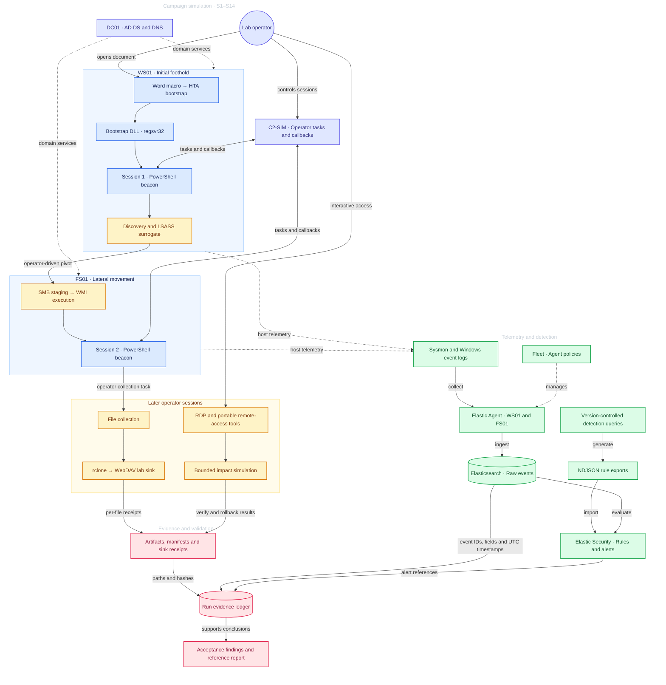

# C0015 Detection Engineering Lab

A detection engineering project that reconstructs the behaviors of
[MITRE ATT&CK Campaign C0015](https://attack.mitre.org/campaigns/C0015/) in a Windows and Active Directory homelab.
Based on [The DFIR Report's investigation](https://thedfirreport.com/2021/11/29/continuing-the-bazar-ransomware-story/),
the lab connects campaign simulation, endpoint telemetry, Elastic Security detections, and recorded evidence.

Controlled surrogates reproduce process, network, authentication, file, and module-load activity across
WS01 and FS01. Each documented run brings together event references, detection results, transfer receipts,
and recovery verification.

**24 detection rules · 5 documented runs · 20 offline component tests**

## Explore the project

| Resource | What to read |
|---|---|
| [Latest run: RUN-20261002-09](reports/reference-run-20261002-09.md) | Campaign timeline, target-selection decision, RDP logon/logoff evidence, and recovery |
| [RUN-09 evidence ledger](evidence/runs/RUN-20261002-09/RUN-20261002-09.json) | Elasticsearch event IDs, UTC timestamps, logon joins, and artifact references |
| [Detection catalogue](detections/README.md) | Rule intent, telemetry, and investigation context |
| [Query sources](detections/queries/) · [NDJSON exports](detections/exports/) | Detection logic and Elastic Security import bundles |
| [Lab architecture](docs/architecture.md) · [Operator runbook](docs/attack-runbook.md) | Environment design, lab procedure, evidence collection, and cleanup |

## Architecture



Fleet manages endpoint policies. Elastic Agents collect Sysmon and Windows Security events and send
them to Elasticsearch, where Elastic Security evaluates the detection rules. The evidence ledger connects
source events and alerts with the artifacts produced during each run.

| System | Role | Lab address |
|---|---|---|
| WS01 | Windows 10 workstation; initial foothold and session 1 | `192.168.50.20` |
| FS01 | Windows 10 Pro file server; Finance/IT data, WMI pivot, and session 2 | `192.168.50.30` |
| DC01 | AD DS and DNS for `c0015.lab` | `192.168.50.10` |
| Windows host | Operator, HTTP staging, C2-SIM, and WebDAV sink | `192.168.50.1` |
| Kali | Auxiliary tooling and Tailscale routing | `192.168.50.100` |
| ELASTIC01 | Elasticsearch, Kibana, and Fleet Server | Tailscale `100.77.46.126` |

The domain network uses VMware VMnet2 (`192.168.50.0/24`, host-only). WS01 and FS01 also have
NAT adapters for installation and updates. The Windows host serves HTTP staging on `:8000`, C2-SIM
on `:8080`, and the WebDAV sink on `:9001`. Endpoint telemetry uses the Elastic namespace `c0015`.

## Recorded results

The latest replay, **RUN-20261002-09**, records the following outcomes:

| Area | Result | Evidence |
|---|---|---|
| Entry and bootstrap | Word macro → HTA → regsvr32 → PowerShell beacon | S1–S3 process events and C2 registrations |
| Discovery and target decision | Discovery batch followed by a recorded decision for the fixed scenario target, FS01 | S4–S6; ART-06-02 |
| Lateral movement | SMB staging, WMI-spawned rundll32, and an unsigned DLL load with SHA-256 verification | S8a/S8b; Security 5145 and Sysmon E1/E7 |
| Second session | FS01 beacon registration and process-owned network activity | S9; ART-07-01 and Sysmon E3 |
| Collection and transfer | 11 files / 309 bytes; two transfer rounds with matching file names, sizes, and hashes | ART-08-01 manifest and two ART-09-01 receipts |
| RDP session | Type-10 logon followed by a Type-10 logoff, joined by `TargetLogonId=0x4cc3dae` on FS01 | S12; Security 4624/4634 and R19 alert IDs |
| Impact and recovery | 15-file bounded simulation; bidirectional verification followed by rollback and hash equality | S14; ART-14-01 |
| Detection | R19 and R23 alert references archived; transfer and impact telemetry recorded | S12/S14 ledger and acceptance scorecard |

All five committed run scorecards record successful verification under the verifier's defined assertions.
The reports retain the configuration, findings, and evidence context for each replay.

| Run | Focus | Report | Ledger |
|---|---|---|---|
| RUN-20261002-05 | Initial recorded chain | [Report](reports/reference-run-20261002-05.md) | [Ledger](evidence/runs/RUN-20261002-05/RUN-20261002-05.json) |
| RUN-20261002-06 | R19 positive and bidirectional impact verification | [Report](reports/reference-run-20261002-06.md) | [Ledger](evidence/runs/RUN-20261002-06/RUN-20261002-06.json) |
| RUN-20261002-07 | Tuned rules and R22/R23/R24 coverage | [Report](reports/reference-run-20261002-07.md) | [Ledger](evidence/runs/RUN-20261002-07/RUN-20261002-07.json) |
| RUN-20261002-08 | Repeat execution with source event and alert references | [Report](reports/reference-run-20261002-08.md) | [Ledger](evidence/runs/RUN-20261002-08/RUN-20261002-08.json) |
| RUN-20261002-09 | Target decision and RDP session evidence | [Report](reports/reference-run-20261002-09.md) | [Ledger](evidence/runs/RUN-20261002-09/RUN-20261002-09.json) |

## Detection suite

The suite contains **23 EQL rules and one KQL threshold rule**. It uses process ancestry, module
signature and path context, logon fields, file creation, and process-owned network activity.

| Behavior | Stages | Rules |
|---|---|---|
| Office, HTA, proxy execution, and bootstrap | S1–S3 | R01–R09 |
| Discovery and share enumeration | S4–S5 | R10–R13 |
| Authentication, privileged context, and LSASS-access surrogate | S7/S7b | R14a/R14b/R15 |
| Admin-share access, WMI pivot, and beacon egress | S8–S10 | R16–R18 |
| Transfer-tool network activity | S11a/b | R24 |
| RDP and portable remote-access tools | S12–S13 | R19/R20 |
| Impact-note creation and same-process note spread | S14 | R22/R23 |

**R17, R18, and R23** are high-severity alerting rules. The remaining **21 rules** are building blocks
for investigation. R17/R18 use EQL sequences; R23 requires at least three distinct file paths grouped
by host and process entity. The [correlation architecture](docs/correlation-architecture.md) documents
the join keys and analyst workflow.

### Import into Elastic Security

Import both bundles from **Security → Rules → Import rules**:

- [c0015-rules-r01-r11.ndjson](detections/exports/c0015-rules-r01-r11.ndjson) — 11 rules.
- [c0015-rules-r12-r24.ndjson](detections/exports/c0015-rules-r12-r24.ndjson) — 13 rules.

Rule numbering includes R14a/R14b; R21 is retired. The exported schedule is one minute, with a
six-minute EQL look-back and a ten-minute R23 threshold window.

The [rule generator](scripts/rules/gen_rules_ndjson.ps1) maintains the export bundles and checks for
empty queries and duplicate IDs. Rule IDs are derived from names, so renaming a rule requires migration
of its existing Elastic configuration.

## Evidence and verification

[Run directories](evidence/runs/) contain event and alert references, artifact indexes, collection
manifests, transfer receipts, and verification outputs. The evidence model supports process-entity joins
within a host and logon-ID joins for authentication/session records on the same host.

Artifact-file hashes use the documented CRLF → LF canonical convention. Transfer receipts compare
each observed payload file against the collection manifest by name, size, and SHA-256.

Run the offline component tests from the repository root:

```bash
python -m unittest discover -s scripts/tests
```

The suite covers artifact handling, manifests, receipts, fixtures, and C2-SIM logic.

To verify a recorded run against retained Elastic telemetry, its runtime C2 log, and committed artifacts:

```bash
python scripts/verify/verify_final_phases.py RUN-20261002-09
```

Supply `ES_PASS` through the environment; `ES_URL` and `ES_USER` select the backend and account.
See [evidence documentation](evidence/README.md) and the [run reports](reports/) for the verification
method and recorded findings.

## Repository structure

| Directory | Contents |
|---|---|
| [docs/](docs/) | Architecture, campaign mapping, runbook, and correlation design |
| [detections/](detections/) | Rule catalogue, query sources, and NDJSON exports |
| [evidence/](evidence/) | Run ledgers, manifests, receipts, and verification records |
| [reports/](reports/) | Run timelines and detection findings |
| [configs/](configs/) | BALANCED and CAPTURE Sysmon profiles |
| [payloads/](payloads/) | Macro, HTA, DLL, beacon, and bounded simulation components |
| [scripts/](scripts/) | C2-SIM, evidence tooling, rule generator, diagnostics, tests, and verifiers |
| [phases/](phases/) | Phase narratives and investigation context |

Runtime configuration and generated tooling use the gitignored `stage/` directory.

## Environment

| Component | Recorded configuration |
|---|---|
| Virtualization | VMware Workstation |
| Directory services | `c0015.lab` / `C0015` |
| Elastic | Elasticsearch, Kibana, and Elastic Agent 9.5.3 |
| Sysmon | 15.21; schema 4.91; [BALANCED configuration](configs/sysmon/sysmon-c0015-balanced.xml) |
| Runtime tooling | Python 3.12.x and PowerShell 7.x |
| Transfer tooling | rclone 1.75.1; internal WebDAV sink |

The lab uses controlled surrogates and a reversible impact corpus. Campaign execution covers S1–S14;
post-run validation, recovery, and cleanup are documented separately.

## References

- [MITRE ATT&CK — Campaign C0015](https://attack.mitre.org/campaigns/C0015/)
- [The DFIR Report — CONTInuing the Bazar Ransomware Story](https://thedfirreport.com/2021/11/29/continuing-the-bazar-ransomware-story/)
- [Campaign mapping and fidelity](docs/attack-chain-plan.md)
- [Correlation architecture](docs/correlation-architecture.md)
- [Payload and C2 design](docs/payloads-and-c2.md)

Licensed under [MIT](LICENSE).
